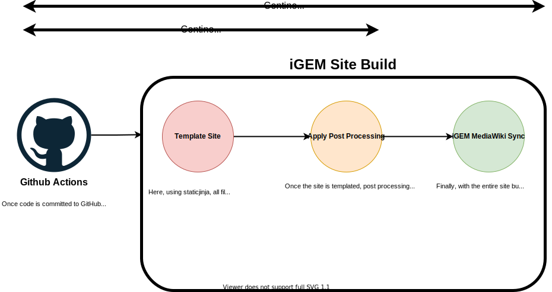
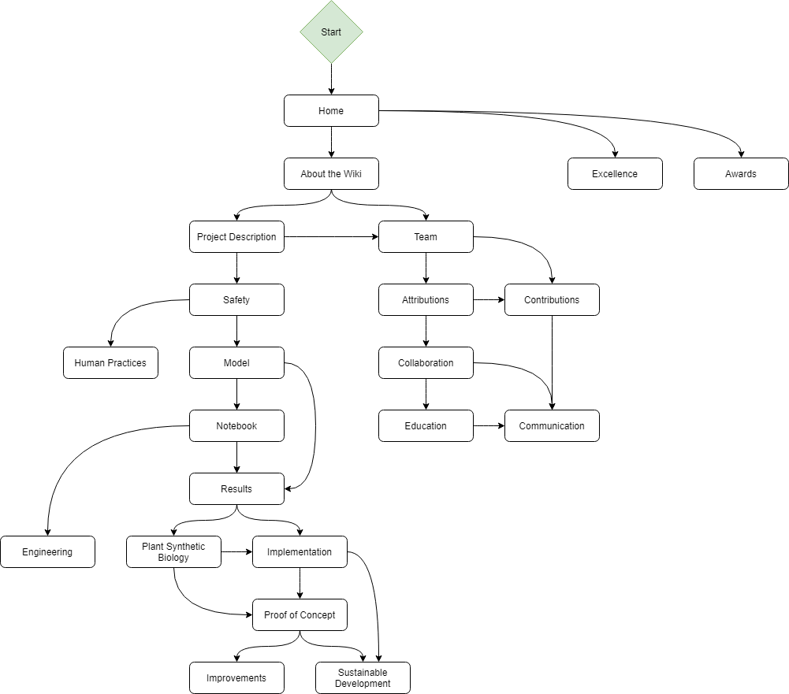

# Miami University's iGEM 2021 Team Website <!-- omit in toc -->


## Table of Contents <!-- omit in toc -->
- [Overview](#overview)
- [Requirements](#requirements)
- [How to Download and Setup the Site](#how-to-download-and-setup-the-site)
- [How to Build the Site (Local)](#how-to-build-the-site-local)
- [How to Edit Pages (Remote / Local)](#how-to-edit-pages-remote--local)
- [How Sync Site with the Team Wiki (Remote)](#how-sync-site-with-the-team-wiki-remote)
- [How to Sync Site with the Team Wiki (Local)](#how-to-sync-site-with-the-team-wiki-local)
- [Helpful](#helpful)
  - [HTML Converter](#html-converter)
- [iGEM Wiki General Information](#igem-wiki-general-information)
  - [Deliverables / Requirements](#deliverables--requirements)
  - [Sitemap](#sitemap)
  - [Default Wiki CSS](#default-wiki-css)
  - [Making Manual Changes](#making-manual-changes)

## Overview
The website for [Miami University's](https://miamioh.edu/) Team Website for the [iGEM 2021 Competition](https://2021.igem.org/Main_Page).

*Important note: There are a lot of strange and sloppily looking design decisions that were made (For instance, a CSS file to undo CSS). These decisions were made to take into account how iGEM's MediaWiki server handles file uploads.*


## Requirements
- [ ] [Git bash](https://git-scm.com/downloads)
- [ ] [Python (version >= 3.0.0)](https://www.python.org/)
- [ ] [Pip](https://pypi.org/project/pip/)
- [ ] [An iGEM account](igem.org)
- [ ] An IDE of your choice ([VSCode](https://code.visualstudio.com/) recommended)

## How to Download and Setup the Site

1. Download the site.
```shell
$ git clone git@github.com:Kyle-L/iGEM-2021-Website.git
```
2. Install Pipenv using pip, install pip if you haven't already.
```shell
$ pip install pipenv
```

3. Setup a virtual environment with Pipenv.
```shell
$ python -m venv env
```

4. (on Windows) Start the virtual environment
```shell
$ ./env/Scripts/activate
```

4. (on Unix / Linux / MAC OS) Start the virtual environment
```shell
$ source env/bin/activate
```

5. Install the requirements
```shell
$ pip install -r requirements.txt
```
Now you are ready to start editing the site!


## How to Build the Site (Local)
To cut down on down on code and make the site more maintainable, the Python package `iGEM Site Builder` has been setup to use as a utility package to aid in the process of building a site for the iGEM competition. What does this mean? In the directory `iGEM-2021-Website/src`, a template layout for all the pages is definined in `iGEM-2021-Website/src/.template.html`. When built, the body of each page which is defined in `iGEM-2021-Website/src/pages` is inserted into this template. So, how do we build the site?

1. Navigate to the root directory
```shell
$ cd iGEM-2021-Website/
```
2. (Optional) Call the `template` command. This will take the body of each page in `iGEM-2021-Website/src/pages` and insert it into the template at `iGEM-2021-Website/src/.template.html`
```shell
$ python igem_site_builder template-site 'temp\\build' 'src'
```
3. (Optional) Call the `post-process` command. Post processing applies some nice quality of life changes to the templated site. To see more on what those specific changes are, checkout section on post-process in documentation for [iGEM Site Builder](igem_igem_site_builder/README.md).
```shell
$ python igem_site_builder post-process 'temp\\build' 'src'
```
4. Alternatively to 2 & 3, you can call `build` which will combine both into one nice command.
```shell
$ python igem_site_builder build 'temp\\build' 'src'
```

You can now view the full website under `iGEM-2021-Website/temp/build`.


## How to Edit Pages (Remote / Local)
To edit pages on the wiki, navigate to [`iGEM-2021-Website/src/pages`](/src/pages). These are the html files which will be present when the site is built. For instance, if you create an html file called `test.html` and insert the following.
```html
<p>This is some placeholder text!</p>
```
When the site is built, that placeholder text will be placed into the layout defined in `.template.html`.


## How Sync Site with the Team Wiki (Remote)
This repository is setup to make use of GitHub Actions and [iGEM Site Builder](igem_igem_site_builder/) to sync the site on a push to the `master` and `dev` branch.
On any push to the master or `dev` branch, GitHub Actions will run the workflow in `.github/workflows/main.yaml` and sync the repository with the iGEM MediaWiki server.

Specifically, the entire CI/CD pipeline looks like the following:



## How to Sync Site with the Team Wiki (Local)
If you need to sync the site with you local wiki, you can use the following instructions.
*Note: This repository is setup to make use of GitHub Actions to sync the site on a push to the master branch. Thus, these instructions should only be used if needed.*

1. Check into the cloned repository's root.
```shell
$ cd iGEM-2021-Website/
```

2. Create the file `.env` at the root of `/iGEM-2021-Website` with following information. Replace `Your_username` and `Your_password` with your iGEM info.
```
IGEM_USERNAME=Your_username
IGEM_PASSWORD=Your_password
```

3. Run `python igem_site_builder sync-site`. *Note: please ensure that you have properly built the site.*
```shell
$ python igem_site_builder sync 'temp\\build' 'temp\\sync' 'MiamiU_OH'
```


## Helpful
### HTML Converter
The utility `python site-builder convert-file` has been supplied to help convert files for web use by converting a `.docx`, `.doc`, or `.md` file to `.html`.

That can be run with the following command: 
```shell
$ python site-builder convert-file <some .docx, .doc or .md path> <some .html path>
```


## iGEM Wiki General Information

### Deliverables / Requirements
Please be conscientious of the requirements for the wiki and the expected deliverables. Failure to take this into account might result in potential disqualification. Carefully read through https://2021.igem.org/Competition/Deliverables/Wiki to ensure that the wiki meeting all requirements.

### Sitemap


### Default Wiki CSS
The iGEM wiki already has a fair amount of CSS applied to each of the pages. If you would like to remove that CSS, add the following CSS to a page between the `style` tags.
```html
<style> 
    #sideMenu,
    #top_title,
    .patrollink,
    #firstHeading,
    #home_logo,
    #sideMenu {
        display: none;
    }
    #content {
        padding: 0px;
        width: 100%;
        margin-top: -7px;
        margin-left: 0px;
        border: none;
    }
    body,
    html {
        background-color: white;
        width: 100%;
        height: 100%;
    }
    #bodyContent h1,
    #bodyContent h2,
    #bodyContent h3,
    #bodyContent h4,
    #bodyContent h5 {
        margin-bottom: 0px;
    }
    #bodyContent a[href ^="https://"], .link-https {
        padding-right: 0px;
    }
</style>
```
For more information of the iGEM default CSS, checkout https://2021.igem.org/Resources/Template_Documentation.

### Making Manual Changes
If you need to make changes to the iGEM wiki manually, you can go in and modify individual pages/templates using the MediaWiki UI. For more information on this checkout https://2021.igem.org/Resources/Wiki_Editing_Help.
